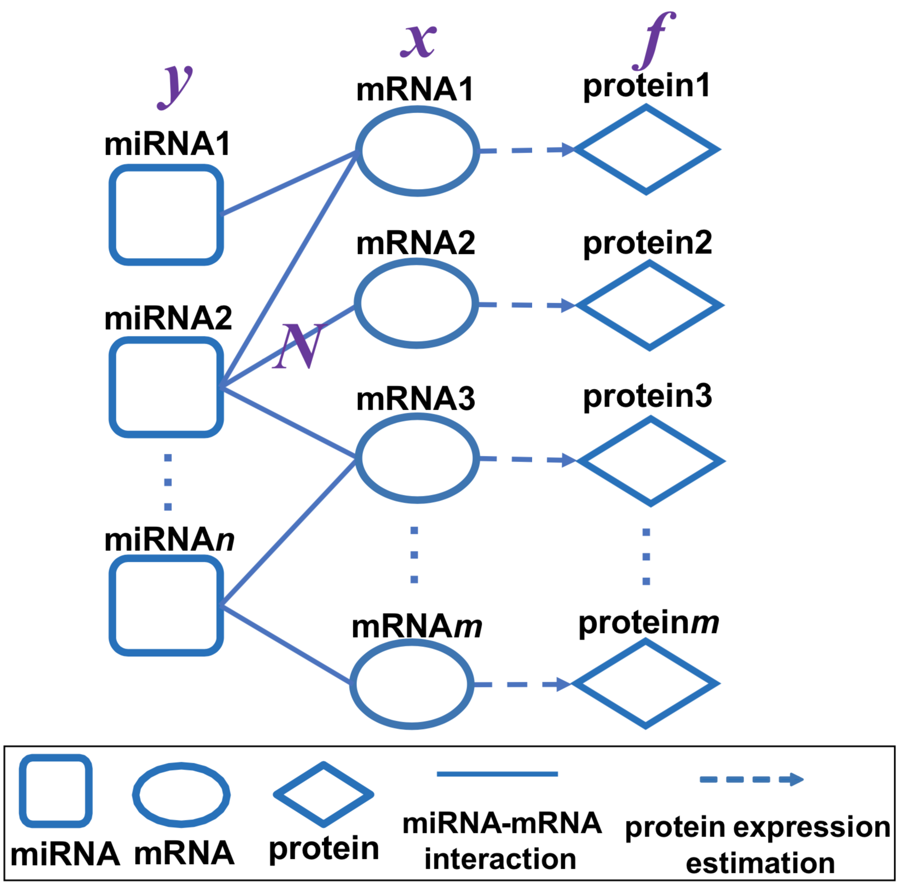

# PTNet
We provide the source code of paper *In Silico Model for miRNA-medicated Regulatory Network in Cancer* for Nucleic Acids Research submission.

## Goal
 - PTNet is a graph-based learning model which simulates the miRNAs (microRNAs) that regulate gene expression post-transcriptionally *in silico*.
 - Our model estimates the protein levels by considering the miRNA-mRNA interaction network, the mRNA expression and the miRNA expression.

## Framework
<p align="center">
  
  <figcaption>An illustration of the proposed graph-based learning model on miRNA-mRNA bipartite graph to estimate the protein expression levels.</figcaption>
</p>

## Required Python packages
 - Numpy
 - Pandas
 - Scipy

## Data
 - bipartite_targetscan.xlsx: miRNA-mRNA interaction network (miRNA by mRNA)
 - gencode23.csv: mRNA to gene symbol conversion (annotation)
 - Ovarian cancer: (1) [mRNA.csv]: mRNA expression data (feature by sample), (2) miRNA.csv: miRNA expression data (feature by sample), (3) spectral_count.tsv: ground truth protein expression (feature by sample).

## Code
 - bipartite_ovarian_transcript.py: run code to generate predicted protein expression from mRNA expression, miRNA expression and their interaction network. Command to run the code: python3 code mRNA_expression miRNA_expression ground_truth_spectral_count alpha. alpha is the coefficient in bipartite network propagation ranging from 0 to 1. Higher value of alpha puts more emphasis on the network, lower value puts more emphasis on the initial mRNA values.
 - Run PTNet with TCGA Ovarian cancer patient samples: 
 ```sh
 $ python3 -W ignore bipartite_ovarian_transcript.py mRNA.csv miRNA.csv spectral_count.tsv 0.6 
 ```


[mRNA.csv]: <https://drive.google.com/file/d/18WrnFyqQcp7GjZc9YdvTtt6acJTHYkLU/view?usp=sharing>
